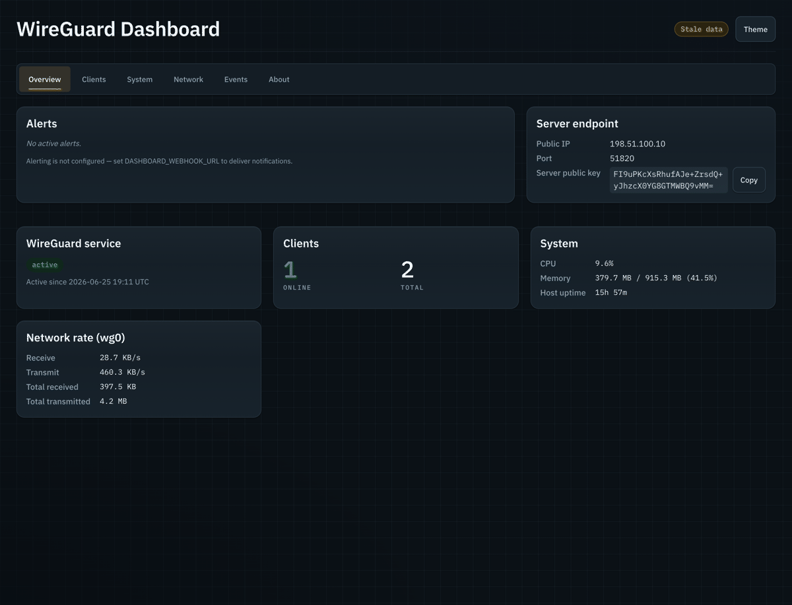

# WireGuard VPN — on AWS *or any Ubuntu VPS* — with a built-in observability dashboard

> A fully codified, self-hosted [WireGuard](https://www.wireguard.com/) VPN server — provision it end-to-end on AWS with Terraform, **or** stand it up on any plain Ubuntu VPS with a single script — plus a single-binary, VPN-only web dashboard for status, traffic, connection history, a peer map, **live client management**, and proactive alerting.


<p align="center">
  
</p>

<p align="center"><sub>The VPN-only dashboard, tab by tab. Captured from a live instance; public IPs, peer locations, and keys are redacted.</sub></p>

---

## What is this?

Most "WireGuard on AWS" guides are a pile of manual steps — click through a VPC, hand-edit security groups, SSH in to install packages, paste keys. This repo replaces all of that with **reviewable infrastructure-as-code**: one `terraform apply` stands up the network, the EC2 host, the security posture, and a fully-configured WireGuard server. The same install logic is packaged as a portable **`scripts/install.sh`**, so you can also bring up the identical stack on any plain Ubuntu VPS — no AWS, no Terraform.

It also ships something most guides don't: a **lightweight observability dashboard** that runs *on the VPN host, reachable only over the tunnel*, so you can see what your VPN is doing — who's connected, from where, how much traffic, and whether anything is broken — **add/remove/edit clients live**, and get pinged in chat when something breaks.

**Who it's for**

- **DevOps / platform engineers** who want an auditable, best-practice Terraform reference for WireGuard on AWS rather than a one-off script.
- **Privacy-conscious developers** who want their own VPN — full control, no logs, no third-party trust — on AWS or a $5 VPS, without spending a weekend wiring up `iptables`.

---

## Features

**Deploy anywhere**

- 🏗️ **One-command AWS deploy** — VPC, public subnet, routing, security groups, IAM, EC2, and WireGuard config in a single `terraform apply`.
- 💻 **Standalone install** — the same WireGuard + dashboard bootstrap as a portable, env-driven `scripts/install.sh` for any Ubuntu VPS (no AWS/Terraform).
- ♻️ **Install / update / remove lifecycle** — re-run to update **in place** (reuses the server key, preserves the live peer set, no tunnel drop); `--uninstall` (keep data) / `--purge` (full wipe) / `--dashboard-only` to tear down cleanly.
- 🧬 **arm64 by default** — a single `cpu_architecture` toggle (Graviton `t4g.micro` default, or `x86_64`); architecture-agnostic boot picks the right dashboard binary.
- 📦 **Reproducible & pinned** — Terraform, providers, and the AMI are pinned to exact versions; remote state in S3 with native locking.

**Live client management**

- 👥 **Manage peers from the dashboard** — add / remove / edit / enable-disable clients at runtime (paste a public key; tunnel IP auto-assigned), applied instantly with `wg syncconf` — **no instance replacement, no downtime, no dropped tunnels**.
- 🌱 **Terraform as a seed** — `clients_config` seeds the client list on first boot; day-to-day changes happen in the UI. An **export** (HCL / tfvars) + a **drift badge** let you reconcile back to git when you choose.
- ⬇️ **Client config download** — grab a ready-to-use peer config (full or split tunnel) for any client. The server **never holds client private keys**.

**Observability & alerting (Go, single static binary)**

- 📊 **Live status** — service health, per-client online/offline, throughput, and recent handshakes resolved to **client names** (one row per peer).
- 🕑 **Connection history** — per-client online/offline timeline, session count, connected time.
- 🗺️ **Offline peer map** — a world map (embedded SVG) of where peers connect from, with zoom & pan. *No external map tiles — zero outbound requests.*
- 🔔 **Proactive alerting** — on service-down, high disk, sustained-high CPU, or a peer over a transfer cap (edge-triggered, with cooldown + recovery). Fans out to a **Slack-compatible webhook, a Slack bot, Telegram, and Discord**; the webhook is manageable (set / test / revert) from the UI. A Prometheus **`/metrics`** endpoint is exposed for external scraping.
- 🎨 **Polished & offline** — a cohesive design system (embedded IBM Plex fonts, light/dark, WCAG-AA), `html/template` + [htmx](https://htmx.org/) + [Chart.js](https://www.chartjs.org/), pure-Go SQLite, embedded GeoIP — no SPA, no build step, no CDNs.

---

## Architecture

```
                    ┌───────────────────────── AWS (us-east-1) ──────────────────────────┐
   you ── WireGuard │  VPC 10.23.0.0/16                                                   │
   client  (UDP     │   └─ public subnet ─ Internet Gateway                               │
         51820) ────┼──▶ EC2 (Ubuntu 24.04, t4g.micro / Graviton by default)              │
                    │     ├─ wg-quick@wg0  (172.16.15.1/24, NAT to internet)              │
                    │     ├─ wireguard-dashboard.service  ──▶ http://172.16.15.1:8080     │
                    │     │     (bound to the tunnel IP — reachable ONLY over the VPN)     │
                    │     └─ IAM role: read server key from SSM (+ SSM Session Manager)    │
                    │  S3: Terraform remote state (native locking)                         │
                    └─────────────────────────────────────────────────────────────────────┘

   …or the same WireGuard + dashboard on any plain Ubuntu VPS via `scripts/install.sh`.
```

- The dashboard binds to the **WireGuard tunnel IP** (`172.16.15.1:8080`), so it's only reachable once you're connected to the VPN — that's the entire access-control model (no login, by design).
- One shared **`scripts/install.sh`** is the source of truth for the install. On AWS, cloud-init fetches and runs it at boot; on a VPS you download and run it yourself — so the two paths can't drift.

---

## Repository layout

```
.
├── scripts/install.sh       # Portable WireGuard + dashboard installer (Ubuntu; the source of truth)
├── terraform/
│   ├── dev/                 # The deployable root module (the environment you apply)
│   │   ├── backend/         #   one-time bootstrap: the S3 state bucket
│   │   ├── locals.tf        #   environment config (region, name, CIDR, tags)
│   │   ├── main.tf          #   composes the network + wireguard modules; client seed list
│   │   └── …
│   └── modules/
│       ├── network/vpc/     # VPC, subnets, routing, default SG
│       └── wireguard/       # EC2 + IAM + SG + SSM key + cloud-init wrapper (fetches install.sh)
├── dashboard/               # The Go observability + client-management dashboard
│   ├── cmd/wireguard-dashboard/
│   ├── internal/            # alerts, clients, db, geoip, history, poller, server, serverinfo, wgsync, …
│   ├── web/                 # html/template + static assets (htmx, Chart.js, fonts, world.svg)
│   └── Makefile             # build / run / test
└── Makefile                 # repo-wide pre-commit (fmt, tflint, trivy, docs) + shellcheck
```

---

## Prerequisites

- **WireGuard tools** (`wg`, `wg-quick`) on your client machine.
- **For the AWS path:** an AWS account + credentials (exported `AWS_PROFILE`); **[Terraform](https://developer.hashicorp.com/terraform/install) `1.14.8`** (exact — versions are pinned); a server private key in **SSM** (created out-of-band, below).
- **For the standalone path:** a plain **Ubuntu** VPS with a public IP, root/sudo, and **inbound UDP 51820** open in the provider firewall.
- For the dashboard: a **public GitHub Release** that publishes the `wireguard-dashboard-<arch>` asset (the bundled CI does this), pinned via a release tag. Leave it unset to install WireGuard only.

---

## Install — Option A: AWS (Terraform)

```bash
git clone https://github.com/vkatrichenko/wireguard-vpn.git
cd wireguard-vpn
export AWS_PROFILE=your-profile   # all terraform/aws commands assume this is set
```

**1. Configure.** Edit [`terraform/dev/locals.tf`](terraform/dev/locals.tf) (region, project name, CIDR, tags) and [`terraform/dev/main.tf`](terraform/dev/main.tf):

```hcl
# terraform/dev/main.tf
# clients_config SEEDS the client list on first boot; after that, manage clients
# live from the dashboard (see "Manage clients" below). Leave it empty to start
# with zero peers and add everyone from the UI.
clients_config = [
  { name = "laptop", address = "172.16.15.2/32", public_key = "<peer-public-key>" },
]

dashboard_release_tag = "v0.0.11"                  # pin the dashboard version ("" disables it)
github_repo           = "vkatrichenko/wireguard-vpn"  # public repo for install.sh + the release binary
# cpu_architecture    = "arm64"                    # default; set "x86_64" for Intel/AMD
```

Generate a peer keypair off-host and paste the **public** key above (keep the private key on the client):

```bash
wg genkey | tee privatekey | wg pubkey > publickey
```

**2. Create the server's WireGuard private key in SSM** (one-time, not managed by Terraform):

```bash
aws ssm put-parameter \
  --name "/config/wireguard-vpn-test/default-private-key" \
  --type SecureString --value "$(wg genkey)"
```

**3. Bootstrap the Terraform state bucket** (one-time, on a fresh clone):

```bash
cd terraform/dev/backend
terraform init
terraform plan -out=tfplan && terraform apply tfplan
```

**4. Deploy the VPN.** From `terraform/dev/`:

```bash
cd ..
terraform init
terraform plan -out=tfplan      # review
terraform apply tfplan          # creates the VPC, EC2, WireGuard, and (if pinned) the dashboard
```

Then **connect** (see [Connect a client](#connect-a-client)) and open the dashboard over the tunnel at **http://172.16.15.1:8080**.

---

## Install — Option B: Any Ubuntu VPS (`install.sh`)

No AWS, no Terraform — the same WireGuard server + dashboard on a plain Ubuntu host.

**1. Prepare the host.** On your VPS provider, open **inbound UDP 51820**. SSH in as a sudo user.

**2. Generate your first client's keypair (on your laptop):**

```bash
wg genkey | tee privatekey | wg pubkey > publickey
cat publickey      # you'll paste this into the dashboard in step 5
```

**3. Download and run the installer (on the VPS).** With the dashboard:

```bash
curl -fsSL https://raw.githubusercontent.com/vkatrichenko/wireguard-vpn/main/scripts/install.sh -o install.sh
sudo DASHBOARD_RELEASE_TAG="v0.0.11" \
     DASHBOARD_RELEASE_REPO="vkatrichenko/wireguard-vpn" \
     bash install.sh
```

For a **WireGuard-only** box, omit the two `DASHBOARD_*` vars: `sudo bash install.sh`. Useful env vars: `WG_SERVER_NET` (default `172.16.15.1/24`), `WG_SERVER_PORT` (`51820`), `WG_CLIENT_DNS` (`1.1.1.1`), `WG_PUBLIC_ENDPOINT` (your VPS public IP, to skip auto-discovery). The installer prints the **server public key** and an **example client config** when it finishes.

**4. Reach the dashboard to add the first client.** The dashboard is VPN-only, so before you're a peer, tunnel to it over SSH:

```bash
ssh -L 8080:172.16.15.1:8080 youruser@<vps-public-ip>
# then open http://localhost:8080 in your browser
```

**5. Add your client** in the Clients tab: paste the **public key** from step 2 and a name. The tunnel IP auto-assigns (e.g. `172.16.15.2/32`).

**6. Build your client config and connect** (see [Connect a client](#connect-a-client)). Once the tunnel is up you're a peer — from then on, reach the dashboard **directly at http://172.16.15.1:8080** and add every future client from the UI (no SSH tunnel needed).

---

## Connect a client

Build `wg0.conf` on your client with the server's **public** IP/key (printed by the installer, `terraform output`, or the dashboard) and the tunnel IP assigned to this client:

```ini
# /etc/wireguard/wg0.conf
[Interface]
PrivateKey = <your client private key>
Address    = 172.16.15.2/32
DNS        = 1.1.1.1               # AWS: the VPC resolver (e.g. 10.23.0.2); VPS: 1.1.1.1

[Peer]
PublicKey  = <server public key>
Endpoint   = <server-public-ip>:51820
AllowedIPs = 0.0.0.0/0, ::/0       # full tunnel (use 172.16.15.0/24 for split)
PersistentKeepalive = 25
```

```bash
sudo wg-quick up wg0
```

Tip: the dashboard's **Config → Full / Split** download fills in everything except your private-key line.

---

## Manage clients

After first boot, the **dashboard is the day-to-day surface** for peers (its on-box SQLite DB is the source of truth):

- **Add / edit / remove / enable-disable** from the Clients tab — applied live via `wg syncconf`, no downtime, other tunnels untouched.
- A **drift badge** flags clients that exist on the box but aren't in your Terraform seed; **Export (HCL / tfvars)** gives you a paste-ready block to reconcile `clients_config` in git so a rebuild keeps them.
- The server never sees a client private key — you always paste a public key.

---

## Update & uninstall (`install.sh`)

Re-running the installer is a **safe in-place update** — it reuses the existing `server.key`, preserves the live peer set (won't clobber dashboard-added clients), applies changes without dropping tunnels, and restarts the dashboard onto the new binary:

```bash
# update: bump the tag and re-run (don't pass WG_SERVER_PRIVATE_KEY — the persisted key is reused)
sudo DASHBOARD_RELEASE_TAG="v0.0.12" DASHBOARD_RELEASE_REPO="vkatrichenko/wireguard-vpn" bash install.sh

sudo bash install.sh --uninstall        # stop + remove services/artifacts, KEEP data (key, conf, client DB)
sudo bash install.sh --dashboard-only   # remove only the dashboard, leave the VPN up
sudo bash install.sh --purge            # remove AND wipe the server key, wg0.conf, and client DB
```

> EC2 teardown stays `terraform destroy`; `--uninstall`/`--purge` are for standalone-VPS hosts.

---

## Configuration

Deployable AWS config lives in [`terraform/dev/locals.tf`](terraform/dev/locals.tf) and [`main.tf`](terraform/dev/main.tf) (this project uses `locals.tf`, not `terraform.tfvars`).

| Setting | Where | Notes |
|---|---|---|
| Region / project / CIDR / tags | `locals.tf` | Region is intentionally duplicated in the S3 backend block (Terraform can't reference locals there) — change both if you move regions. |
| Peer **seed** | `main.tf` → `clients_config` | Seeds first boot only; manage clients in the dashboard afterward. |
| Dashboard version | `main.tf` → `dashboard_release_tag` | Single source of truth for the running build (`""` = no dashboard). |
| GitHub repo | `main.tf` → `github_repo` | One slug feeding both the `install.sh` fetch and the release download (must be public). |
| CPU architecture | `main.tf` → `cpu_architecture` | `"arm64"` (default, `t4g.micro`) or `"x86_64"` (`t3a.micro`). |
| Server key | SSM `/config/<project>-<env>/default-private-key` | Created out-of-band; read at boot. On a VPS it's persisted to `/etc/wireguard/server.key`. |

### Alerting (optional)

The dashboard pushes alerts on **service-down, high disk, sustained-high CPU, and per-peer transfer cap** (edge-triggered, with cooldown + recovery). Config is **environment-variable only** (portable across clouds), supplied to the systemd unit via an `EnvironmentFile`:

| Variable | Default | Purpose |
|---|---|---|
| `DASHBOARD_WEBHOOK_URL` | _(unset = no webhook)_ | Slack-compatible incoming webhook. Also settable at runtime from the **About** tab (in-memory, resets on restart). |
| `DASHBOARD_SLACK_BOT_TOKEN` / `_SLACK_CHANNEL` | _(unset)_ | Slack bot (`chat.postMessage`) transport. |
| `DASHBOARD_TELEGRAM_TOKEN` / `_TELEGRAM_CHAT_ID` | _(unset)_ | Telegram transport. |
| `DASHBOARD_DISCORD_WEBHOOK_URL` | _(unset)_ | Discord transport. |
| `DASHBOARD_ALERT_DISK_PCT` | `90` | High-disk threshold. |
| `DASHBOARD_ALERT_CPU_PCT` / `_CPU_SUSTAIN` | `90` / `5m` | Sustained-CPU threshold + window. |
| `DASHBOARD_ALERT_TRANSFER_BYTES` | `50GiB` | Per-peer transfer cap. |

All transports are opt-in and a silent no-op when unset; alerts are always visible in the dashboard, and a Prometheus **`GET /metrics`** endpoint exposes current values for external scraping.

---

## Development

**Repo-wide quality gate** (runs `terraform fmt`, `terraform-docs`, `tflint`, and `trivy` in Docker; plus `make shellcheck` for `scripts/*.sh`):

```bash
make pre-commit
make shellcheck
```

**The dashboard** (from `dashboard/`):

```bash
make build      # static linux binary (CGO-free); fetches the GeoIP DB on first run
make test       # go test ./...
make run        # local dev — serves on 127.0.0.1:8080

LISTEN_ADDR=127.0.0.1:8080 DB_PATH=/tmp/wgd.db go run ./cmd/wireguard-dashboard
```

> On macOS the host-data cards show "failed to load" (no `/proc`, `wg`, or `systemd`) — expected; the UI still renders for design/preview work.

**Conventions** (enforced): exact version pins (no ranges); `plan -out=tfplan` → review → `apply tfplan` (never bare `apply`; apply is manual/local, no CI apply); every resource carries `Environment`, `Project`, `Owner`, `Managed` via provider `default_tags`.

---

## Security model

- **Access is the tunnel.** The dashboard binds to `172.16.15.1:8080` (the WireGuard interface), so it's unreachable except over the VPN. There is no in-band auth — connecting to the VPN *is* the authentication. The write surfaces (webhook management + client management) inherit this VPN-only trust.
- **No SSH (on AWS).** Instance access is via SSM Session Manager; port 22 is not exposed.
- **Secrets stay out of the repo.** The server key is an SSM SecureString (AWS) or a `0600` `server.key` (VPS); the alert secrets are env/SSM-supplied and never logged in full or rendered in the UI.
- **The dashboard holds no client private keys** and makes **no outbound requests** for its own operation (embedded map + GeoIP, no CDNs) — the only egress it adds is the opt-in alert transports and the off-AWS public-IP lookup (skippable via `WG_PUBLIC_ENDPOINT`).

---

## Status & roadmap

The deployable AWS environment, the standalone installer, and the full dashboard feature set — including **runtime client management** and the **install/update/remove lifecycle** — are implemented and in use (specs 002–016). Detailed product / architecture / roadmap notes live under [`context/product/`](context/product/), and per-feature specs under [`context/spec/`](context/spec/).

---

## Contributing

Contributions are welcome. Please:

- Work on a branch and open a **PR** (`feat/…`, `fix/…`, `infra/…`, `docs/…`, `refactor/…`, `chore/…`); use Conventional-Commit-style messages.
- Run `make pre-commit` (and `make test` in `dashboard/`) before pushing.
- Keep Terraform changes plan-reviewable and follow the exact-pin / tagging conventions above.

---

## License

This project is licensed under the **Apache License 2.0** — see [`LICENSE`](LICENSE) for the full text. Copyright 2026 Vladyslav Katrychenko.

Bundled third-party components retain their own licenses and are attributed in [`NOTICE`](NOTICE) (reconciled with [`dashboard/web/static/VENDORED.txt`](dashboard/web/static/VENDORED.txt)):

- **IBM Plex Sans / Mono** — SIL Open Font License 1.1
- **World map outline** (Natural Earth–derived `world.svg`) — Public Domain
- **GeoIP data** — [DB-IP IP-to-City Lite](https://db-ip.com/db/lite.php), CC BY 4.0 (fetched at build, not committed)

---

## Acknowledgements

[WireGuard](https://www.wireguard.com/) · [DB-IP](https://db-ip.com/) · [IBM Plex](https://www.ibm.com/plex/) · [Natural Earth](https://www.naturalearthdata.com/) · [htmx](https://htmx.org/) · [Chart.js](https://www.chartjs.org/) · [`modernc.org/sqlite`](https://pkg.go.dev/modernc.org/sqlite)
